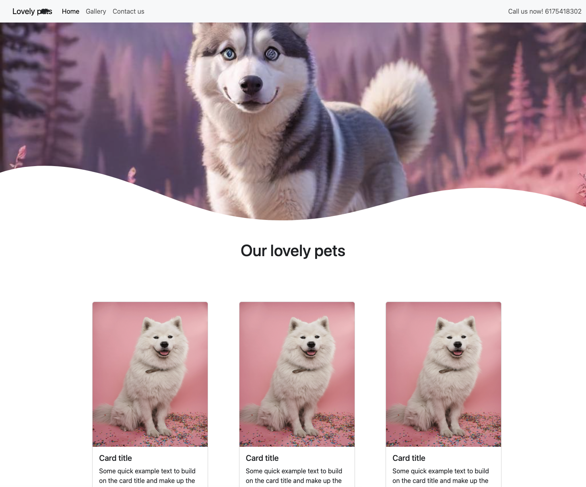
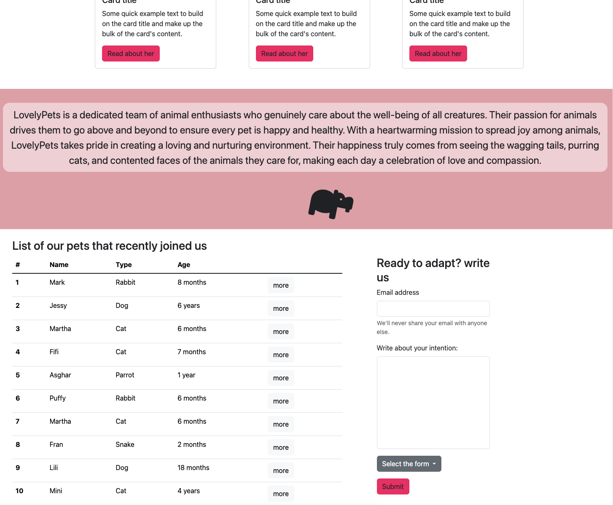
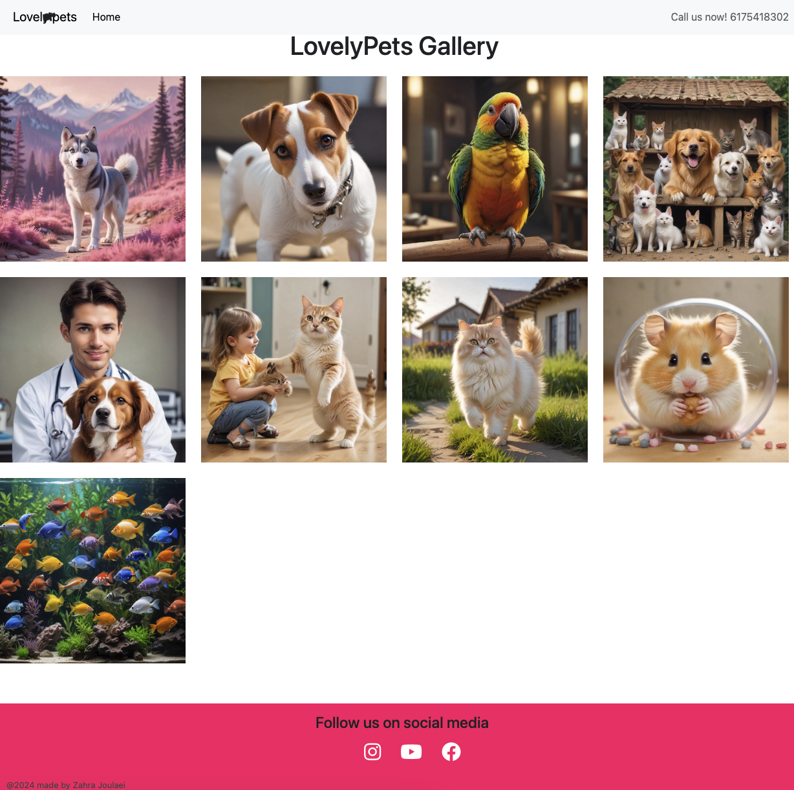
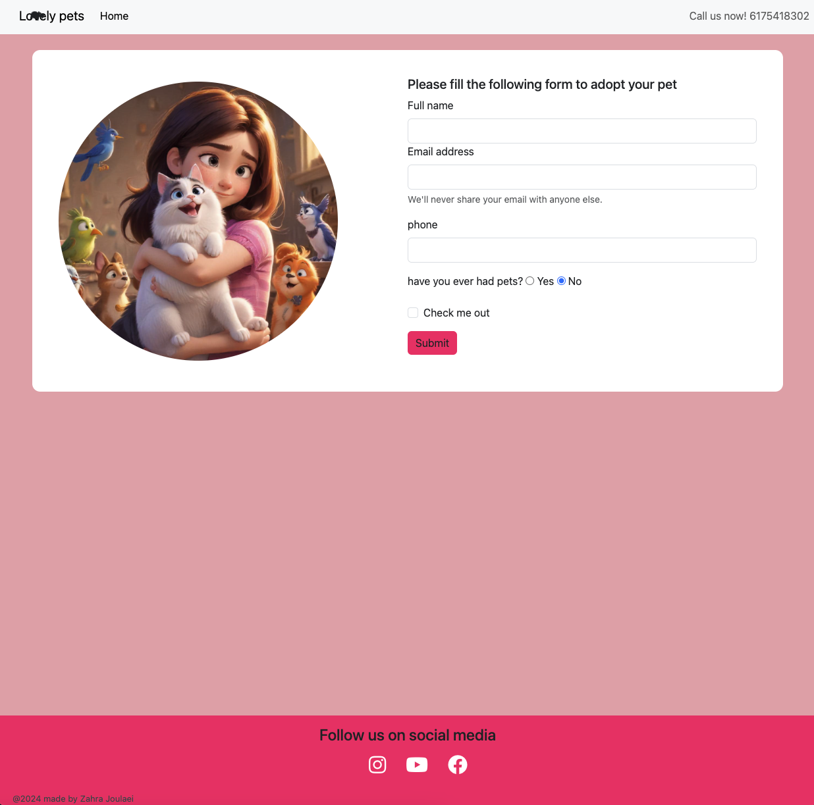

# Lovely Pet Website

## Overview

**Lovely Pet** is a user-friendly website designed to provide an engaging and visually appealing experience for pet enthusiasts. The website consists of three main pages: Home, Gallery, and Contact Form. It is built using HTML, CSS, and Bootstrap, ensuring responsiveness and ease of use across various devices.


## Demo

check the liv demo here:

https://main--cheerful-profiterole-addde5.netlify.app/
## Features

- **Home Page**: An inviting introduction to the website with an overview of the services and offerings.
- **Gallery**: A collection of beautiful pet images
- **Contact Form**: A simple and effective way for visitors to get in touch

## Technologies Used

- **HTML**
- **CSS**
- **Bootstrap**
- **FontAwesome**

## Installation

To set up the project locally, follow these steps:

1. **Clone the repository**:
    ```sh
    git clone https://github.com/zahrajoulaei/lovelypet
    ```

2. **Navigate to the project directory**:
    ```sh
    cd lovelypet
    ```

3. **Install Bootstrap and dependencies**:
    ```sh
    npm install bootstrap
    ```

## Usage

Open `index.html` in your web browser to view the Home page. Navigate to the Gallery and Contact Form pages using the navigation bar.

## Animations and Icons

The website includes custom CSS animations and transitions to enhance user experience. FontAwesome icons are utilized for various UI elements, including a favicon for the website.

## Sceenshots







## Contact

For any inquiries or feedback, please contact me at [zahrajoulaei@gmail.com](mailto:zahrajoulaei@gmail.com).Lovely pet is about all the pets make our lives more beautiful :)
